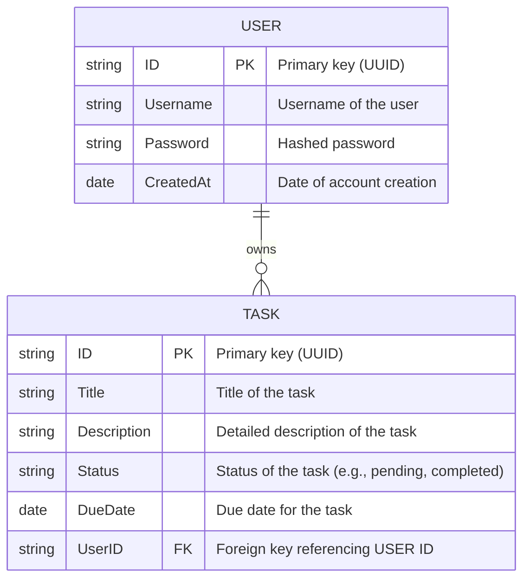

# Task Management System

## Overview

The Task Management Systerm allows users to manage task. 

## 1. Technologies Used

- **Programming Language**: Go (Golang)
- **Web Framework**: Fiber
- **Authentication**: JWT (JSON Web Tokens)
- **Database**: MongoDB Atlas (Managed NoSQL database)

## 2. Models

### 3. API Endpoints

#### User Management Endpoints

- **POST `/signup`**
    - **Description**: Registers a new user.
- **POST `/signin`**
    - **Description**: Authenticates a user and generates a JWT token.
- **POST `/signout`**
    - **Description**: Invalidates the user's JWT token.

#### Task Management Endpoints

- **POST `/tasks`**
    - **Description**: Creates a new task.
- **GET `/tasks`**
    - **Description**: Retrieves all tasks for the authenticated user.
- **GET `/tasks/:id`**
    
    - **Description**: Retrieves a specific task by ID.
- **PUT `/tasks/:id`**
    
    - **Description**: Updates a task by ID.
- **DELETE `/tasks/:id`**
    
    - **Description**: Deletes a task by ID.

### 4. Database Setup

- **Database**: MongoDB Atlas
- **Connection**: MongoDB URI stored in environment variables.

## 5. Authentication

- **JWT (JSON Web Token)**: Used to authenticate users and secure API endpoints.