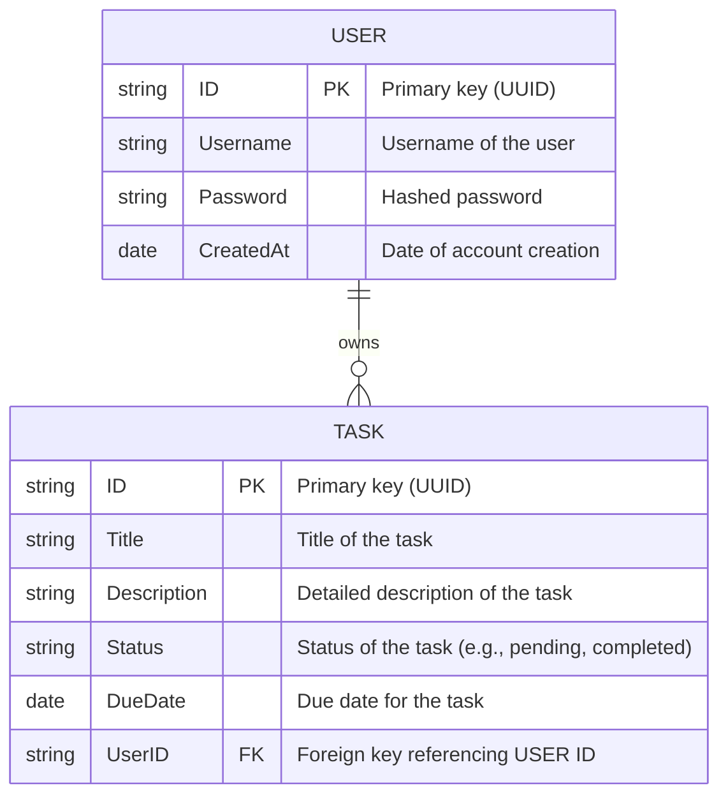
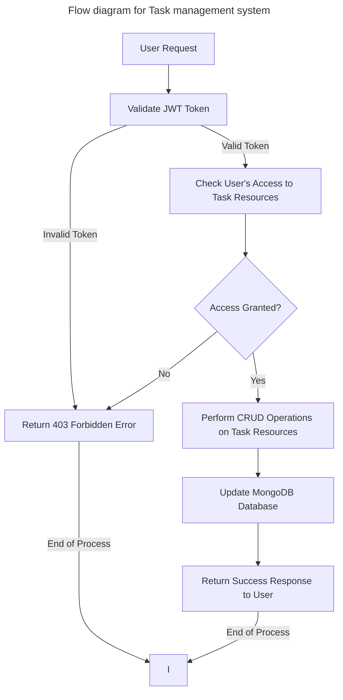
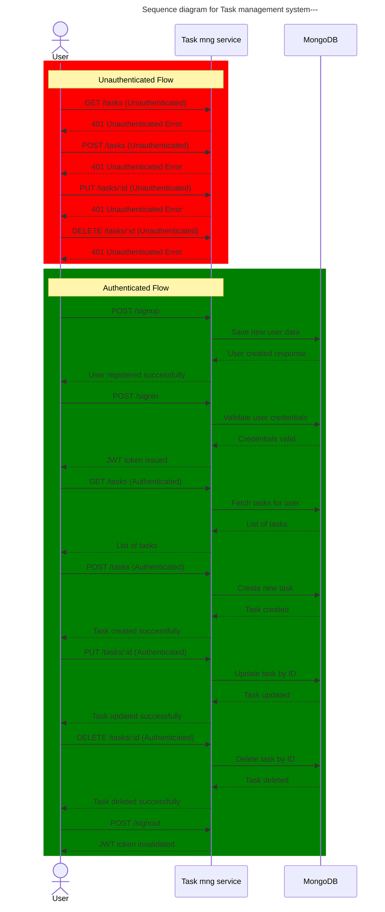

# Task Management System

## Overview

The Task Management Systerm allows users to manage task. 

## 1. Technologies Used

- **Programming Language**: Go (Golang)
- **Web Framework**: Fiber
- **Authentication**: JWT (JSON Web Tokens)
- **Database**: MongoDB Atlas (Managed NoSQL database)

## 2. Models



### 3. API Endpoints

#### User Management Endpoints

- **POST `/signup`**
    - **Description**: Registers a new user.
- **POST `/signin`**
    - **Description**: Authenticates a user and generates a JWT token.
- **POST `/signout`**
    - **Description**: Invalidates the user's JWT token.

#### Task Management Endpoints

- **POST `/tasks`**
    - **Description**: Creates a new task.
- **GET `/tasks`**
    - **Description**: Retrieves all tasks for the authenticated user.
- **GET `/tasks/:id`**
    
    - **Description**: Retrieves a specific task by ID.
- **PUT `/tasks/:id`**
    
    - **Description**: Updates a task by ID.
- **DELETE `/tasks/:id`**
    
    - **Description**: Deletes a task by ID.

### 4. Database Setup

- **Database**: MongoDB Atlas
- **Connection**: MongoDB URI stored in environment variables.

## 5. Authentication

- **JWT (JSON Web Token)**: Used to authenticate users and secure API endpoints.

## 6. Architecture Diagram

#### Flow diagram




#### Sequence Diagram




#### 7. Unit Test Cases

##### User Management Endpoints

- **POST `/signup`**
    
    - Test for successful user registration.
    - Test for duplicate username registration.
    - Test for missing or invalid fields in the request body.
- **POST `/signin`**
    
    - Test for successful authentication and token generation.
    - Test for incorrect username or password.
    - Test for missing fields in the request.
- **POST `/signout`**
    
    - Test for successful token invalidation.

##### Task Management Endpoints

- **POST `/tasks`**
    
    - Test for successful task creation.
    - Test for creating a task with missing or invalid fields.
    - Test for unauthorized access without a valid JWT.
- **GET `/tasks`**
    
    - Test for retrieving all tasks for the authenticated user.
    - Test for unauthorized access without a valid JWT.
- **GET `/tasks/:id`**
    
    - Test for retrieving a specific task by ID.
    - Test for retrieving a task that doesn’t exist.
    - Test for unauthorized access.
- **PUT `/tasks/:id`**
    
    - Test for successful task update.
    - Test for updating a task that doesn’t exist.
    - Test for unauthorized access.
- **DELETE `/tasks/:id`**
    
    - Test for successful task deletion.
    - Test for deleting a task that doesn’t exist.
    - Test for unauthorized access.
  
### 8. Error Handling

- **Error Codes**: Standard HTTP status codes are used for errors.
- **Error Messages**: Custom error messages are provided to assist in debugging.

### 9. Environment Variables

Create a `.env` file with the following configuration:
```env
MONGODB_URI="your-mongodb-atlas-uri"
JWT_SECRET="your-jwt-secret-key"
```

### 10. Dev environment setup

##### Prerequisites
- Golang (v1.17 or later recommended)
- Docker (for containerized deployment)
- MongoDB Atlas (setup with connection credentials)
- Git (for version control)
- Environment Variables: The .env file should be created as per instructions in the Environment Variables section.

##### Install Dependencies
```bash
make setup
```

##### Run Tests
```bash
make test
```

##### Generate Test Coverage Report
```bash
make test-report
```

##### Run Locally
```bash
make run
```

##### Run in Docker
###### Build the Docker image:
```bash
make docker-build
```

###### Run the Docker container:
```bash
make docker-run
```

##### To verify MongoDB Atlas connectivity, use:
```bash
make check-db
```

##### To clean up generated files such as coverage reports:
```bash
make clean
```


